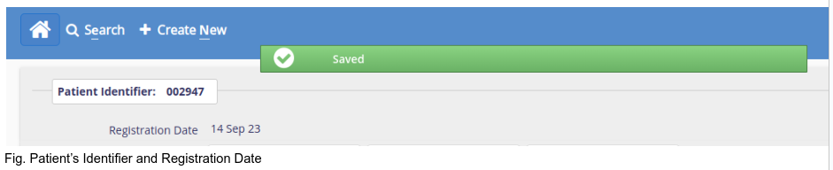
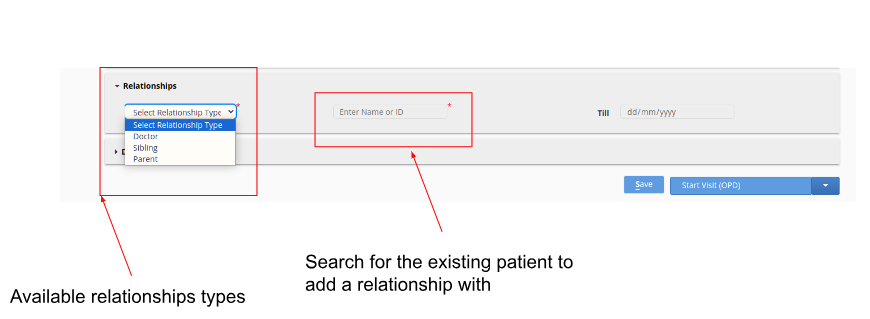
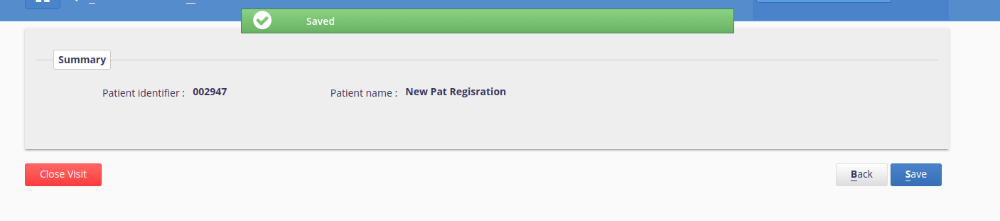
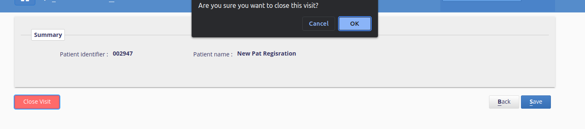
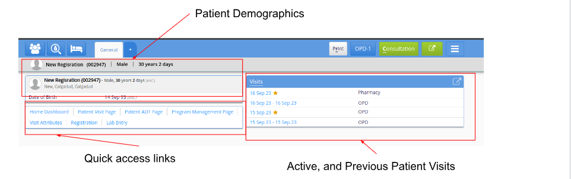
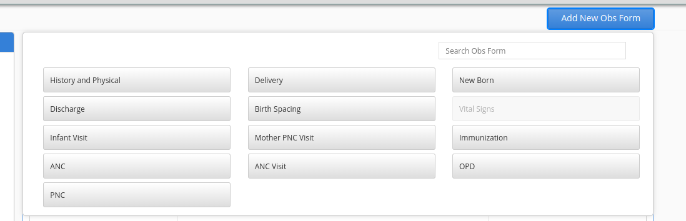
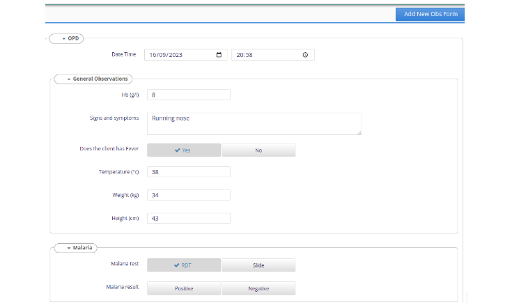
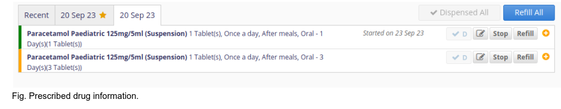

#  RAAD EHR End User Guide

## Introduction to RAAD EHR

The RAAD EHR system is an electronic health record (EHR) and hospital information system designed to digitise patient management and healthcare delivery at the point of care, ultimately enhancing the quality, efficiency, and cost-effectiveness of healthcare services. It captures information about who received the services, who provided the services, where the services were received, and what specific care was received. 

In addition, it is built on Bahmni, an open-source EHR system, and is highly customizable and configurable to meet the specific needs of different health facilities.
The RAAD EMR system includes the following key modules:
Client & Patient Registration: Allows healthcare providers to register patients and create their medical records.
Consultation & Medication/pharmacy: Allows healthcare providers to document patient consultations, prescribe medications, and track medication orders.
Program Specific Consultation: Allows healthcare providers to document consultations for specific programs, such as HIV/AIDS or malaria.
Laboratory workflow management: Allows healthcare providers to manage laboratory tests and results.
Data management Reports Module: Allows healthcare providers to generate reports on patient data.
Metadata Management Module: Facilitates healthcare providers to manage metadata, such as the definitions of terms and codes.
User management Module: Facilates healthcare providers to manage user accounts and permissions.
HMIS Reporting Module: This module allows healthcare providers to generate reports and integrate with the Somalia HMIS system.

## Clinical Service
RAAD EHR - Clinical Service 
The Clinical module of the EHR provides the functionality for patient registration, clinical and medication management(triage, diagnosis, prescription, observations, Lab orders ), inpatient management, and report generation.

To access the RAAD EHR landing page, use the EHR URL [uat.raad.moh.gov.so](https://uat.raad.moh.gov.so).

Then click on the Clinical Services Icon

### User Login
The EHR provides user login for the providers who are providing services to the patients/clients.  
For the user to login to the Clinical module, they need to provide their username and password, if they don’t have an access account they will need to request it from the system administrator at the health facility.
The system only allows only authenticated users to login. If the user is logging in for the first time, the user will be required to change their password and provide a new password.
In addition, the user will need to select the location they are providing service based on the available options(Service point areas).

* `RAAD username` - Enter Your Username.
* `RAAD password` - Enter Your Password.
* `Location` - Location.

If the user login information is incorrect, the system will let the user know and provide the error message on the login page. If the user error persists, please contact the system administrator for assistance.

On successful login, the system will redirect the user to the Clinical App landing page, and display the available functionalities based on the level of access of the user. 

#### Registration App
The patient registration app provides the ability to start and edit a patient record at the health facility. It allows users to search for existing patient records, add new patients, edit existing patient records, start or close a patient visit.

*  It provides a patient search based on name, phone number or village

*  It autogenerates a patient unique identifier

*  It allows the patient's address details and any additional information to be captured.

*  It capture relationships between patients and other patients/doctors

*  It allows the printing out of patient identification cards

*  It drives patient workflow based on visit types.

*  It eases facility management by tracking the number of times a patient visits a health facility and the kind of encounters he/she goes through during a       particular visit.

Access the Patient Registration
- On the Clinical App landing page, click on the Registration App. This will direct you to the registration page.

##### Searching for an existing patient.

* `Using ID` - Unique patient identifier
Which is auto-generated by the system upon new patient registration

* `Using other Attributes` - Using either the patient name or phone number or village or a combination of all.

After searching, if there are available registered patients matching the search criteria, the patients will be listed. Then to open a specific patient registration information can be selected from the list. If no patient matches the criteria, the list will have no patient records listed.       
 

##### Adding A New Patient

Please note that before adding a patient to the system, it is essential to conduct a search and verification process to check if the patient has already been registered. This step is crucial to prevent the creation of duplicate records and to ensure data accuracy. 

Information to provide when adding a new patient:

* `Personal Information` - i.e patient’s names, gender, age, date of birth and image profile. Note the field names with a red asterisk on the name are required fields. 

* `Address information` -  i.e state, region, district and village (optional)

* `Additional identifiers` - i.e passport number (Optional)

* `Other information` - i.e  includes contact information i.e email address, phone number(required), next of kin, marital status 

After adding the patient’s details click the Save button which is on the bottom right of the registration page  so as to save the patient’s data.

If one of the required fields is not provided, the system will display an error on the required field

After clicking on the save button a ‘saved’ message with a green background  will pop on top of the registration page as well as a unique patient identifier will be auto generated and the date the patient was added if all te requred attributes are filled.

Upon saving the details, a patient registration card can be generated by clicking on the  ‘Print Registration Card’  button(at the top right corner of the page)

##### Updating Patient's Information

To update a patient's details, you can perform a search using one of the following criteria: their name, their unique patient ID, or their phone number. If there are patients in the system that match your search criteria, their information will be displayed in a list.

* Carefully review the patient information listed to ensure that you are selecting the correct patient for the update.

* Make the necessary updates by editing the appropriate fields with the new information.

* Once you've made the updates, click the 'Save' button. This action will save the updated details in the system.

#### Additional Information

You can add additional information on the last section of the first tab on the registration page which majorly includes the patient’s next of kin contact details, and other additional fields. Note these are optional fields, only the phone number is mandatory.

#### Add Relationships (optional)

The middle area of the registration page has a ‘Relationships’ section, which upon clicking has a drop-down box with three types of relationships i,e doctor,sibling and parent and you can add the next of kin relationship with the patient. After selecting the relationship, search using the patient name or patient unique identifier to link the relationship. Once you confirm all the details are correctly mapped, save the record. Note the patient record can only be linked to patients or providers already existing in the system.

#### Starting A visit and Closing A Visit

##### Starting A Visit

A patient visit encompasses the entire process of a patient's interaction with a healthcare facility, from registration and triage to clinical assessment, treatment, and other encounters. Eg. laboratory, and inpatient etc. A visit type is the categorization or classification of patient visits based on the purpose or nature of the appointment. This is different from one EPHS facility level to another. 

To start a visit, on the registration page(located at the bottom right, just beside the 'Save' button), there is a 'Start Visit' button with a drop down of different visit types.

The Start visit types includes: 

* OPD (Outpatient)

* PNC (Postnatal Care)

* Nutrition

* Pharmacy

* Delivery

* Laboratory

* EPI (Immunisation)

* Select the appropriate visit type, when clicked, this button will automatically update the patient's status to 'Started Visit' after their registration.
* On the preceding page, click “Save”, and the patient visit will be active.  
* When the visit is active, the patient can access services on the clinical, program and inpatient modules.

##### Closing A visit
Closing a patient visit means the patient won’t be active on the clinical queue or available to receive services. This should be done once a patient visit or patient encounters with the clinicians have been completed. If not closed, the system will automatically close the visits at the end of the day(at midnight).

If the patient has already begun their visit:

* On the patient registration page, the 'Start Visit' button changes to 'Enter Visit Details.'

* Click the 'Enter Visit Details' button.

* A summary of the patient's visit will be displayed.

Click the 'Close Visit' button, which has a red background.

A message will pop up on the page, inquiring, 'Are you sure you want to close this visit?'

* Click the 'OK' button in the popup menu to confirm.

* Alternatively, click 'Cancel' to close the popup without taking any action.

Once the patient visit is closed, the patient won’t be accessible on the clinical patient queue. 

#### Clinical Application
This is a core module and serves multiple purposes, including viewing the treatment history of existing patients, initiating consultations and treatment for registered patients. It can be conveniently accessed through the 'Clinical' app on the system's landing page.

Additionally, this module facilitates searching, viewing, and editing patient observations, placing lab requests, recording patient diagnoses and conditions, and dispensing medications to patients. It's important to note that the clinical module is specifically designed for patients who currently have an active visit.

##### Clinical Patient Queue
It contains different patient queues for patients having an active visit at the health facility. The different queues are based on the patient's visit type.  Note, for patients admitted they will always be active until they are discharged. 

##### Patient's Dashboard
It contains the patient's information summary from the date of their first recorded visit and it aids in capturing and documenting various types of observations, encounters, diagnosis, treatment and assesments to a patient’s medical health record.

It highlights the patient demographics,  history and contains the patient's previous and active visits and earlier diagnosis and treatments provided. 

It is accessed by clicking a specific patient with an active visit on the clinical patient queue.

On the patient dashboard, there are quick access links to facilitate easy navigation between different pages.
 The quick access links include:

* Home Dashboard, goes back to the landing page of the clinical service.

* Patient Visit Page, to view detailed information of the patient's previous hospital visits.

* Patient ADT page, to view the patient admission page and perform actions to either admit or discharge the patient.

* Visit Attributes, to go to the patient start visit page. 

* Registration, to go to the patient’s registration information for view or updating.

* Lab entry, to go to the lab entry window for the specific patient lab tests

##### Observation Forms

###### Vital Information Forms
It is an observation form used to record a patient's vital signs and essential physiological measurements that provide important information about their overall health and well-being.

It can be accessed by clicking on the  “Consultation” button on the top right corner of  the patient’s dashboard page.

* After completing to fill the form you will need to click  the  ‘Save’ button on the top right corner  so as to save the details.

* Upon successful saving the system will generate the date the information was recorded on the side panel beside the form name.

* If there’s a validation error, the system will display the error on a pop up window and highlight the specific fields with issues for the user to look into and capture the information correctly. 

###### History and Examination

It is used to gather comprehensive information about a patient's medical history, current health status, and the findings from a physical examination. 

This form is typically used by healthcare providers, including physicians, nurses, and other clinicians, to guide their assessment and diagnosis of a patient's condition.

It can be accessed by clicking the ‘Add New Obs Form’ button on the observations page, 
then on the observation forms available will be listed. 

For one to view the history and examination form, you will need to click it on the displayed table for an empty form to be shown.

Then fill the form of the patient’s health complaint together with the history and the examination notes.

On the Chief complaint data section after filling in the patient’s symptoms/signs and on clicking the accept button which is in the same section, a drop-down button with various options i.e hours,days,weeks will be generated on how long the patient has been having the symptoms or the complaints.

If the patient has more than one complaint you can click on the add icon at the end of the segment to add them.

After completing filling  the form, review and verify that the information added is correct then save the form.

###### Other Observation Forms

ther observation forms available, and to be filled during a patient encounter while receiving a specific service include:

* Delivery 

* NewBorn

* Discharge

* Birth Spacing

* Infant Visit

* Mother PNC Visit

* Immunisation

* ANC 

* ANC Visit

* OPD

* PNC

Capturing information on the observation forms follows the same process. 

 OPD Observation form. 

##### Cosultation Notes
They are the notes captured by physicians/specialists that highlight crucial information about a patient's medical condition based on the observations, examinations, and lab test results if conducted. 

It is accessed from the patient's dashboard, by clicking the ‘Consultation’ tab.

It incorporates the saved observations’s forms data to ease the writing of the consultation notes

After consultation notes have been added,  save the consultation notes using the save button on the top right corner of the page.

##### Laboratory Orders
It consists of the lab test catalogue which includes  test names, test codes and test requirements and the tab is to be operated by lab technicians.

It is accessed from the  patient’s dashboard by clicking the ‘Laboratory orders’ tab.

On selecting the tests to be run on the patient the system displays the selected tests at a window on the bottom left corner of the form and after verification those are the tests to be performed click on the save button to save  the details 

##### Diganosis Module

It is a module designed to manage and document the diagnosis and clinical assessment of patients. It plays a critical role in the healthcare workflow by allowing healthcare providers to record and access diagnostic information efficiently. It can be accessed from the fourth tab on the patient’s dashboard 
with a ‘Diagnosis’ title.

After completing filling the information which includes the patient’s diagnosis and conditions,  save the information provided.

Please note the capturing of the diagnosis and condition information will be based on ICD11 coding. 

##### Drug Module/Pharmacy Module/Medication Module

It is a specialised component designed to manage and streamline pharmacy-related tasks and information within a healthcare facility. This module plays a crucial role in ensuring the safe and efficient delivery of medications to patients. It can be accessed from the fifth tab on the patient’s dashboard with a ‘Medications’ title

After the prescription has been added, the pharmacy user will dispense the medication to the patient by clicking "dispense all” or specifically selecting “D” on each prescription then saving.
In addition, the module supports electronic prescribing (e-prescribing) of medications to external pharmacies, improving efficiency and accuracy in prescription processing.

##### Disposition Module

It refers to a component that focuses on documenting and managing the disposition of patients after they have received care or undergone assessment in a healthcare facility.
 The disposition represents the outcome of a patient's visit or encounter. This module helps streamline the process of deciding and documenting what happens to the patient next  i.e 
* Discharge

* Admission

* Home care 

* Referral

* Follow-up appointment

It can be accessed on the last tab on the patient’s dashboard with the title “Disposition”.

## Laboratory Module

The laboratory platform is built on the open source laboratory information systems (OpenELIS)  that provides different lab management features and workflows, and seamlessly integrates with the electronic medical record system. 
To access the Laboratory platform, click on the “Laboratory” app on the landing page using the following URL 
[uat.raad.moh.gov.so](https://uat.raad.moh.gov.so).
