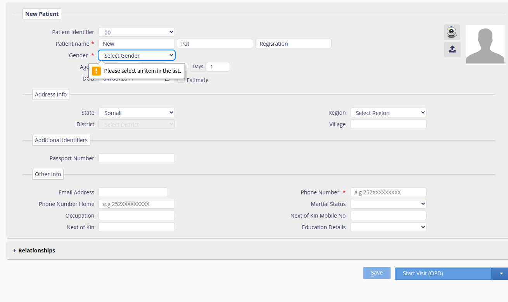

#  RAAD EHR End User Guide

## Introduction to RAAD EHR

The RAAD EHR system is an electronic health record (EHR) and hospital information system designed to digitise patient management and healthcare delivery at the point of care, ultimately enhancing the quality, efficiency, and cost-effectiveness of healthcare services. It captures information about who received the services, who provided the services, where the services were received, and what specific care was received. 

In addition, it is built on Bahmni, an open-source EHR system, and is highly customizable and configurable to meet the specific needs of different health facilities.
The RAAD EMR system includes the following key modules:
Client & Patient Registration: Allows healthcare providers to register patients and create their medical records.
Consultation & Medication/pharmacy: Allows healthcare providers to document patient consultations, prescribe medications, and track medication orders.
Program Specific Consultation: Allows healthcare providers to document consultations for specific programs, such as HIV/AIDS or malaria.
Laboratory workflow management: Allows healthcare providers to manage laboratory tests and results.
Data management Reports Module: Allows healthcare providers to generate reports on patient data.
Metadata Management Module: Facilitates healthcare providers to manage metadata, such as the definitions of terms and codes.
User management Module: Facilates healthcare providers to manage user accounts and permissions.
HMIS Reporting Module: This module allows healthcare providers to generate reports and integrate with the Somalia HMIS system.

## Clinical Service
RAAD EHR - Clinical Service 
The Clinical module of the EHR provides the functionality for patient registration, clinical and medication management(triage, diagnosis, prescription, observations, Lab orders ), inpatient management, and report generation.

To access the RAAD EHR landing page, use the EHR URL [uat.raad.moh.gov.so](https://uat.raad.moh.gov.so).

Then click on the Clinical Services Icon

### User Login
The EHR provides user login for the providers who are providing services to the patients/clients.  
For the user to login to the Clinical module, they need to provide their username and password, if they don’t have an access account they will need to request it from the system administrator at the health facility.
The system only allows only authenticated users to login. If the user is logging in for the first time, the user will be required to change their password and provide a new password.
In addition, the user will need to select the location they are providing service based on the available options(Service point areas).

* `RAAD username` - Enter Your Username.
* `RAAD password` - Enter Your Password.
* `Location` - Location.

If the user login information is incorrect, the system will let the user know and provide the error message on the login page. If the user error persists, please contact the system administrator for assistance.

On successful login, the system will redirect the user to the Clinical App landing page, and display the available functionalities based on the level of access of the user. 

#### Registration App
The patient registration app provides the ability to start and edit a patient record at the health facility. It allows users to search for existing patient records, add new patients, edit existing patient records, start or close a patient visit.
  It provides a patient search based on name, phone number or village
  It autogenerates a patient unique identifier
  It allows the patient's address details and any additional information to be captured.
  It capture relationships between patients and other patients/doctors
  It allows the printing out of patient identification cards
  It drives patient workflow based on visit types.
  It eases facility management by tracking the number of times a patient visits a health facility and the kind of encounters he/she goes through during a particular visit.

Access the Patient Registration
 - On the Clinical App landing page, click on the Registration App. This will direct you to the registration page.

##### Searching for an existing patient.

* `Using ID` - Unique patient identifier
Which is auto-generated by the system upon new patient registration

* `Using other Attributes` - Using either the patient name or phone number or village or a combination of all.

After searching, if there are available registered patients matching the search criteria, the patients will be listed. Then to open a specific patient registration information can be selected from the list. If no patient matches the criteria, the list will have no patient records listed.       
 

##### Adding A New Patient

Please note that before adding a patient to the system, it is essential to conduct a search and verification process to check if the patient has already been registered. This step is crucial to prevent the creation of duplicate records and to ensure data accuracy. 

Information to provide when adding a new patient:

* `Personal Information` - i.e patient’s names, gender, age, date of birth and image profile. Note the field names with a red asterisk on the name are required fields. 

* `Address information` -  i.e state, region, district and village (optional)

* `Additional identifiers` - i.e passport number (Optional)

* `Other information` - i.e  includes contact information i.e email address, phone number(required), next of kin, marital status 

After adding the patient’s details click the Save button which is on the bottom right of the registration page  so as to save the patient’s data.

If one of the required fields is not provided, the system will display an error on the required field

