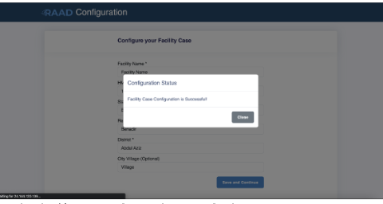
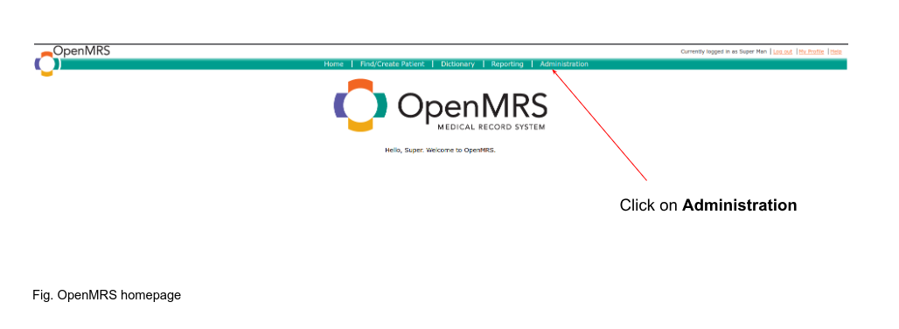
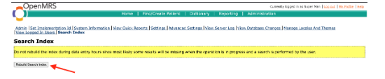

#  User Support

# Deployment

## Requirements

To deploy the RAAD installer, you will need:

* A CentOS cloud-based server having at least 4GB of RAM and 20GB of free disk space.

* The IP address of the CentOS server

* The username and password for the CentOS server

* Root privileges on the system

* The RAAD installer package

* Chrome or Firefox web browser installed.

## Installation

RAAD can be installed with simple steps using the installer package.

Within the terminal, enter the following command, replacing __username__ with the username of the
remote user and __ip-address__ with the IP address or domain name of the remote server.

``` 
ssh [username]@[ip-address]

```
The SSH client attempts to connect to the remote server over port 22 (the default SSH port).

When you connect with a server for the first time, the SSH client on Windows 10 prompts
you to check and verify the host key’s fingerprint. This is normal, and results in output
similar to:

*The authenticity of host ‘example.com (__93.184.216.34__)’ can&#39;t be established. ECDSA key
fingerprint is __SHA256:d029f87e3d80f8fd9b1be67c7426b4cc1ff47b4a9d0a84__. Are you sure you
want to continue connecting (yes/no)?*

Accept the prompt by entering __y or yes__, which results in a one-time warning that is like:

__*Warning: Permanently added &#39;example&#39; (ECDSA) to the list of known hosts*.__

Once you have been successfully connected, your terminal will be using the remote shell environment for
the server. Your command prompt will show the username and hostname configured to the
server.

You can now run any commands that you have available on that server. This includes many of
the basic Linux commands, such as ls, cd, rm, and those covered in Using the Terminal guide. Getting to
know these commands will help you navigate around your server.

* Install curl command to fetch installer with the following command:

```
sudo apt-get update &amp;&amp; sudo apt-get install curl
```
* Finally, all you need to get up and running is to execute the following:


```
curl -k https://uat.raad.moh.gov.so/2gv7o-l2e4q/download/install-raad.sh | sudo bash
```

* When prompted with a github token like the following:

 *Password for &#39;https://GitHubUser@github.com&#39;:*

   __Enter token and press enter__.

## Upgrading RAAD 

*  RAAD can be upgraded to the newest version using the following simple steps.Update using
raad-update command

```
sudo bash /opt/ehr_docker/bin/raad-update
```
*  When prompted with a github token like the following:

*Password for &#39;https://GitHubUser@github.com&#39;:*

__Enter token and press enter__


## Initialization

The first time you install RAAD, it will take about 5 to 10 minutes to initialize. It creates some necessary
files and folders and activates all its modules. After the first initialization, the software will start up much
faster.


### ​Post-Installation Steps
Once RAAD is installed, you will need to complete the following steps:

* __*Configure RAAD by the following steps*__.

  Goto /raad/configuration/ where you will be greeted with this page.


After you’ve filled in all the necessary information marked with red astericks hit __save__ and __continue__



* __*Rebuild search index  Note wait for initialization to finish*__.

To do that first go to [https://&lt;machine-ip&gt;/openmrs/](https://&lt;machine-ip&gt;/openmrs/)   And login with the
credentials as to gain access to the application section. Then navigate to __administration__.




 Click __Rebuild Search Index__ Button.



Upon clicking one will be directed to the following page


## Access the Application
Open your browser (Chrome or Firefox) and access the following applications replace __&lt;machine-ip&gt;__
with __localhost__ if you are running RAAD on a local machine. And use the following credentials:

| Application      | URL                                   | Credentials   |
| :---             |                            :----:     |          ---: |
| RAAD EMR UI      | [https://&lt;machine-ip&gt;/home ]    |               |
| RAAD Lab         | [https://&lt;machine-ip&gt;/openelis ]|               |


## Frequently Asked questions


## Tutorials


## Contact information


